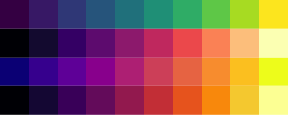
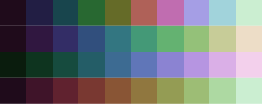

chroma
======

`chroma` is a [R](https://www.r-project.org) package for parsing and formating colors in various specifications, manipulating colors, and creating nice color scales and palettes. Much of the functionality is based on the excellent [chroma.js](https://github.com/gka/chroma.js/) javascript library by [Gregor Aish](http://driven-by-data.net).

Installation
------------

`chroma` is not on CRAN yet. To get it from this page, install the package `devtools` and

``` r
devtools::install_github("jiho/chroma")
library("chroma")
```

Color parsing
-------------

Parse colors in various specifications

``` r
rgb(r=0.5, g=0.5, b=0.5)
```

    # [1] "#808080"

``` r
hsv(h=120, s=0.5, v=0.5)
```

    # [1] "#408040"

``` r
hsl(h=120, s=0.5, l=0.5)
```

    # [1] "#40bf40"

``` r
hsi(h=120, s=0.5, i=0.5)
```

    # [1] "#3fff3f"

``` r
hcl(h=120, c=0.5, l=0.5)
```

    # [1] "#638127"

``` r
lab(l=0.5, a=-0.5, b=0.2)
```

    # [1] "#008a53"

``` r
hex("#393939")
```

    # [1] "#393939"

``` r
hex("F39")
```

    # [1] "#ff3399"

``` r
css("rgb(100,100,100)")
```

    # [1] "#646464"

``` r
temperature(5600)
```

    # [1] "#ffede2"

Parse directly from a matrix

``` r
x <- matrix(c(0.2, 0.5, 0.5, 0.5, 0.6, 0.4), ncol=3)
print(x)
```

    #      [,1] [,2] [,3]
    # [1,]  0.2  0.5  0.6
    # [2,]  0.5  0.5  0.4

``` r
rgb(x)
```

    # [1] "#338099" "#808066"

Color formating
---------------

Convert back in various formats

``` r
as.rgb("coral1")
```

    #        r   g  b
    # [1,] 255 114 86

``` r
as.hsv("coral1")
```

    #             h         s v
    # [1,] 9.940828 0.6627451 1

``` r
as.hsl("coral1")
```

    #             h s         l
    # [1,] 9.940828 1 0.6686275

``` r
as.hsi("coral1")
```

    #            h        s         i
    # [1,] 8.89147 0.432967 0.5947712

``` r
as.hcl("coral1")
```

    #             h         c         l
    # [1,] 38.74251 0.6651031 0.6494095

``` r
as.lab("coral1")
```

    #              l        a         b
    # [1,] 0.6494095 0.518758 0.4162358

``` r
as.hex("coral1")
```

    # [1] "#ff7256"

``` r
as.css("coral1")
```

    # [1] "rgb(255,114,86)"

``` r
as.temperature("coral1")
```

    # [1] 2686

Color manipulation
------------------

Slightly modify a base color

``` r
col <- "#7BBBFE"
show_col(c(col, brighten(col), darken(col)))
```


``` r
show_col(c(col, desaturate(col), saturate(col)))
```


Make a color semi-transparent

``` r
col <- "#7BBBFE"
show_col(c(col, alpha(col), alpha(col, 0.2)))
```


Mix two colors

``` r
show_col(c("#7BBBFE", "#FDFF68", mix("#7BBBFE", "#FDFF68")))
```


Compute the contrast between two colors

``` r
contrast("darkblue", "darkgreen")
```

    # [1] 2.056261

``` r
contrast("yellow", "darkgreen")
```

    # [1] 6.927705

Compute the perceptual distance between two colors (following the CIE Delta E 2000 formula)

``` r
delta_e("darkblue", "darkgreen")
```

    # [1] 57.91349

``` r
delta_e("lightgreen", "darkgreen")
```

    # [1] 43.52127

which allows to find the closest perceived color in a array of possibilities

``` r
target <- "limegreen"
choices <- rainbow(10)
closest_color <- choices[which.min(delta_e(target, choices))]
show_col(target, choices, closest_color)
```


Extract or set a color channel

``` r
col <- "#7BBBFE"
channel(col, model="hcl", "h")
```

    #        h 
    # 266.7734

``` r
channel(col, model="hsv", "s")
```

    #        s 
    # 0.515748

``` r
channel(col, model="hsi", "i")
```

    #         i 
    # 0.7372549

``` r
channel(col, model="rgb", "r")
```

    #   r 
    # 123

``` r
col1 <- col2 <- col
channel(col1, model="hcl", "h") <- 120
channel(col2, model="hcl", "l") <- 1
show_col(c(col, col1, col2))
```


Compute or set the perceived luminance of a color

``` r
luminance(c("red", "yellow", "darkblue"))
```

    # [1] 0.2126000 0.9278000 0.0186408

``` r
col1 <- col2 <- col <- "#7BBBFE"
luminance(col)
```

    # [1] 0.4690736

``` r
luminance(col1) <- 0.6
luminance(col2) <- 0.2
show_col(c(col, col1, col2))
```


Color scales and palettes
-------------------------

All scales and palettes are organised the same way:

-   functions ending in `*_scale` return a *function* that takes a numeric vector `x` as argument and returns the corresponding colors in the scale.
-   functions ending in `*_map` are shortcuts that build the scale, map the values, and return the colors.
-   functions ending in `*_palette` return a *function* that takes an integer `n` as argument and returns `n` equally spaced colors along the scale.
-   functions ending in `*_colors` are shortcut that create the palette and return the `n` colors.

``` r
x <- 0:10/10
s <- color_scale()
s(x)
```

    #  [1] "#ffffff" "#e2e2e2" "#c6c6c6" "#ababab" "#919191" "#777777" "#5e5e5e"
    #  [8] "#474747" "#303030" "#1b1b1b" "#000000"

``` r
# or
color_map(x)
```

    #  [1] "#ffffff" "#e2e2e2" "#c6c6c6" "#ababab" "#919191" "#777777" "#5e5e5e"
    #  [8] "#474747" "#303030" "#1b1b1b" "#000000"

``` r
n <- 11
p <- color_palette()
p(n)
```

    #  [1] "#ffffff" "#e2e2e2" "#c6c6c6" "#ababab" "#919191" "#777777" "#5e5e5e"
    #  [8] "#474747" "#303030" "#1b1b1b" "#000000"

``` r
# or
interp_colors(n)
```

    #  [1] "#ffffff" "#e2e2e2" "#c6c6c6" "#ababab" "#919191" "#777777" "#5e5e5e"
    #  [8] "#474747" "#303030" "#1b1b1b" "#000000"

Palettes can be built by interpolating between colors

``` r
show_col(interp_colors(10))
```


``` r
show_col(interp_colors(10, colors=c("#2D2B63", "#F7FF84")))
```


``` r
show_col(interp_colors(10, colors=c("#2D2B63", "#FB3C44", "#F7FF84")))
```


``` r
show_col(interp_colors(10, colors=c("#2D2B63", "#FB3C44", "#F7FF84"), interp="bezier"))
```


Preset palettes are available, from colorbrewer

``` r
show_col(lapply(brewer_info$name, function(x) {brewer_colors(n=7, name=x)}))
```


Or viridis

``` r
show_col(
  viridis_colors(10),
  magma_colors(10),
  plasma_colors(10),
  inferno_colors(10)
)
```



Or cubehelix

``` r
show_col(
  cubehelix_colors(10),
  cubehelix_colors(10, h=300, rot=-0.75),
  cubehelix_colors(10, h=120, rot=0.5),
  cubehelix_colors(10, h=300, rot=0.5)
)
```



New, perceptually appropriate, palettes can be built in HCL space, for either discrete

``` r
show_col(hue_colors(10))
```


or continuous variables

``` r
show_col(chroma_colors(10, h=140))
```


``` r
show_col(light_colors(10, h=140))
```


------------------------------------------------------------------------

Happy coloring!
